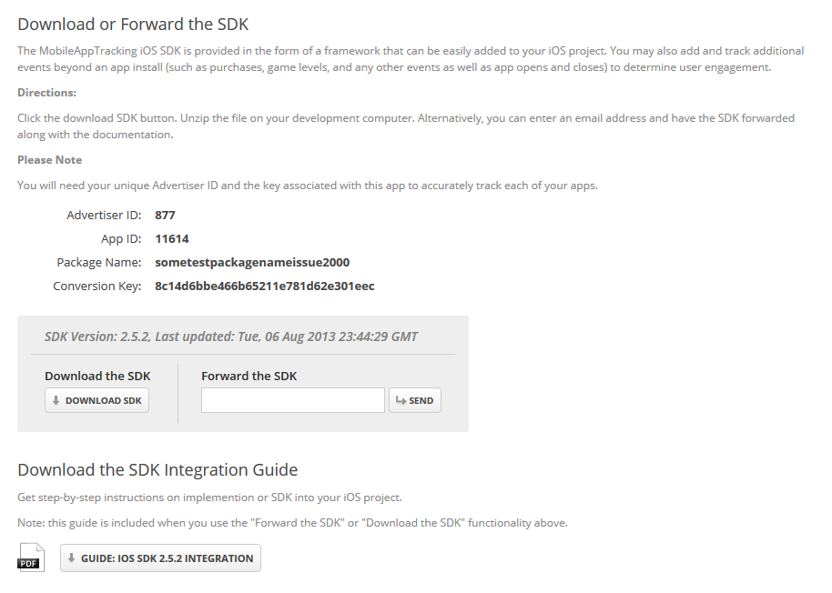

# MAT Unity Plugin

The MobileAppTracking (MAT) Plugin for Unity provides basic application install 
and event tracking functionality via the MobileAppTracking SDKs. To track installs, 
you must integrate the Unity plugin with your Unity app. Once the plugin is integrated 
and set to track installs, you can add and track additional events beyond an app 
install (such as purchases, game levels, and any other user engagement).

This document outlines the Unity Plugin integration and use cases.

## Implementation

To integrate the MobileAppTracking plugin in your Unity app, you will be creating a 
C# file that will attach to a Unity GameObject as a script. Depending on the platform 
(UNITY_ANDROID or UNITY_IPHONE), you will import the corresponding MobileAppTracking 
Unity library and make tracking calls with it.

We have included sample code in the plugin repository inside folder “sample” that shows 
how you might set up your Unity scene to include a script calling the MobileAppTracking library.

1. Create a new Unity project. Create a C# script file.

2. In the C# scripts, DllImport attribute needs to be set for each method to be imported from the plugin code.

	__Android:__

		[DllImport ("mobileapptracker")]

	__iOS:__

		[DllImport ("__Internal")]

3. If you want to target both Android and iOS platforms, then you can use conditional compilation.

	For example:

		#if UNITY_ANDROID

		[DllImport ("mobileapptracker")]
		private static extern void initNativeCode(string advertiserId, string conversionKey);

		#endif

		#if UNITY_IPHONE

		[DllImport ("__Internal")]
		private static extern void initNativeCode(string advertiserId, string conversionKey);

		#endif

4. Import the constructor, initNativeCode, as indicated above.

5. You'll then need to call the initNativeCode function to instantiate a MobileAppTracker class.
Choosing where to instantiate a new class is a decision that is unique to your application/code design, 
but one example (which we use in the sample code) is to call it in the Awake() function of an empty 
GameObject in our startup scene:

		void Awake () {
			initNativeCode("your_advertiser_id", "your_advertiser_key");
			return;
		}

	You will need to pass in the advertiser ID and key associated with your app in MobileAppTracking to the initNativeCode constructor.

	The “your_advertiser_id” and the “your_advertiser_key” values may be found on the “Tracking Code for XXXApp”
	page by clicking on the “Download SDK” button and clicking on the appropriate mobile app.

	
	

## Platform-Specific Settings

### Android

Place libmobileapptracker.so and the Android SDK MobileAppTracker.jar in an Assets/Plugins/Android folder of your Unity project.

__Configure AndroidManifest.xml:__

To set the Android manifest for your Unity app on Android, create an AndroidManifest.xml file in the Assets->Plugins->Android 
folder of your project. If you’re not sure what this should look like, the default manifest can be found at:

"Unity3/Editor/Data/PlaybackEngines/androidplayer/AndroidManifest.xml”

__Install Referral (Required):__

The SDK requires setting up a MobileAppTracker receiver in your Android manifest. Put this receiver inside your application tags.

	receiver android:name="com.mobileapptracker.Tracker" android:exported="true">
		<intent-filter>
			<action android:name="com.android.vending.INSTALL_REFERRER" />
		</intent-filter>
	</receiver>

For more information on how MobileAppTracking uses the INSTALL_REFERRER, please see [How Google Play Install Referrer Works](http://support.mobileapptracking.com/entries/22561636-how-google-play-install-referrer-works).
If your app has multiple receivers for INSTALL_REFERRER, you will need to write a custom receiver that will call these receivers instead.

Learn how to [setup multiple Android install referrers](http://support.mobileapptracking.com/entries/23684142-Multiple-Android-Install-Referrers).

Before closing the manifest tag, add the following permissions in as the SDK uses them.

a. __Internet Permission__ (Required):

Internet permission is required to connect to tracking servers.

	<uses-permission android:name="android.permission.INTERNET" />

b. __Offline Tracking Permission__ (Required):

These permissions enable the SDK to queue tracking events while the user is not connected to the 
Internet. Once the user is online, the SDK will process all queued events.

	<uses-permission android:name="android.permission.ACCESS_NETWORK_STATE" />

c. __Wifi State Permission__ (Required):

These permissions enable the SDK to access information about whether you are connected to a Wi-Fi 
network and obtain the device's MAC address.

	<uses-permission android:name="android.permission.ACCESS_WIFI_STATE" />

d. __Phone State Permission__ (Required):

Allows the user's device ID to be recorded.

	<uses-permission android:name="android.permission.READ_PHONE_STATE" />

### iOS:

The post build trigger script PostBuildTrigger.cs placed under the Assets/Editor folder is automatically run when the Unity project is built.
This script updates the iOS project as necessary -- adds the MAT plugin .h, .mm files and includes the required frameworks. No other manual configuration is required.

## Installs and Updates

As the success of attributing app events after the initial install is dependent upon first tracking that install, 
we require that the install is the first event tracked. To track install of your mobile app, use the “trackInstall” 
method. If users have already installed your app prior to SDK implementation, then these users should be tracked as updates.

### Track Installs

To track installs of your mobile app, use the Track Install method. Track Install is used to track when users install your 
mobile app on their device and will only record one conversion per install in reports. We recommend calling trackInstall() 
in the first scene’s Awake method after instantiating a MobileAppTracker class with initNativeCode.

	[DllImport ("mobileapptracker")]
	private static extern void trackInstall();

	trackInstall();

The “trackInstall” method automatically tracks updates of your app if the app version differs from the last app version it saw.

### Handling Installs Prior to SDK Implementation - Track as Updates

What if your app already has thousands or millions of users prior to SDK implementation? What happens when these users update 
the app to the new version that contains the MAT SDK?

MAT provides you two ways to make sure that the existing users do not count towards new app installs.

1. Call SDK method "trackUpdate" instead of "trackInstall".

	If you are integrating MAT into an existing app where you have users you’ve seen before, you can track an update yourself with the trackUpdate() method.

		[DllImport ("mobileapptracker")]
		private static extern void trackUpdate();

		trackUpdate();

2. Import prior installs to the platform.

These methods are useful if you already have an app in the store and plan to add the MAT SDK in a new version. 
Learn how to [handle installs prior to SDK implementation here](http://support.mobileapptracking.com/entries/22621001-Handling-Installs-prior-to-SDK-implementation).

If the code used to differentiate installs versus app updates is not properly implemented, then you will notice 
a [spike of total installs](http://support.mobileapptracking.com/entries/22900598-Spike-of-Total-Installs-on-First-day-of-SDK) on the first day of the SDK implementation.

## Events

After the install has been tracked, the “trackAction” method is intended to be used to track user actions such as reaching a 
certain level in a game or making an in-app purchase. The “trackAction” method allows you to define the event name dynamically.

All events have the same import code:

	#if UNITY_ANDROID
		[DllImport ("mobileapptracker")]
		private static extern void trackAction(string eventName, bool isId, double revenue, string currencyCode);
	#endif

	#if UNITY_IPHONE
		[DllImport ("__Internal")]
		private static extern void trackAction(string eventName, bool isId, double revenue, string currencyCode);
	#endif

You need to supply the "eventName" field with the appropriate value for the event; e.g. "registration". If the event does
not exist, it will be dynamically created in our site and incremented. You may pass a revenue value, currency code,
or whether you are using an event ID or event name, as optional fields.

### Registration

If you have a registration process, it's recommended to track it by calling trackAction set to “registration”.
Using the aforementioned import code, you would call the following:

	trackAction("registration", false, 0, “USD”);

You can find these events in the platform by viewing Reports > Event Logs. Then filter the report by the “registration” event.

While our platform always blocks the tracking of duplicate installs, by default it does not block duplicate event requests. 
However, a registration event may be an event that you only want tracked once per device/user. 
Please see [block duplicate requests setting for events](http://support.mobileapptracking.com/entries/22927312-Block-Duplicate-Request-Setting-for-Events) for further information.

### Purchases

The best way to analyze the value of your publishers and marketing campaigns is to track revenue from in-app purchases.
By tracking in-app purchases for a user, the data can be correlated back to the install and analyzed on a cohort basis 
to determine revenue per install and lifetime value.

Using the aforementioned import code, you would call the following:

	trackAction("purchase", false, 0.99, “USD”);

__Track In-App Purchases__
The basic way to track purchases is to track an event with a name of purchase and then define the revenue (sale amount) and currency code.

Note: Pass the revenue in as a Double and the currency of the amount if necessary.  Currency is set to "USD" by default.
See [Setting Currency Code](http://support.mobileapptracking.com/entries/23697946-Customize-SDK-Settings) for currencies we support.

You can find these events in platform by viewing Reports > Logs > Events. Then filter the report by the “purchase” event.

### Opens

The SDK allows you to analyze user engagement by tracking unique opens. The SDK has built in functionality to only track one “open” event
per user on any given day to minimize footprint. All subsequent “open” events fired on the same day are ignored and will not show up on the platform.

Using the aforementioned import code, you would call the following:

	trackAction("open", false, 0, “USD”);

You can find counts of Opens by viewing Reports > Mobile Apps. Include the parameter of Opens to see the aggregated count.
The platform does not provide logs of Opens. If you track Opens using a name other than "open" then these tracked events will
cost the same price as all other events to track.

### Other Events

You can track other events in your app dynamically by calling “trackAction”. The “trackAction” method is intended for tracking
any user actions. This method allows you to define the event name.

To dynamically track an event, replace “event name or action” with the name of the event you want to track. The tracking engine
will then look up the event by the name. If an event with the defined name doesn’t exist, the tracking engine will automatically
create an event for you with that name. An Event Name has to be alphanumeric.

	trackAction(string eventName, bool isId, double revenue, string currencyCode);

You can pass in an event name or event id. If you pass in an event name and isId = false, then you are indicating to the SDK that
you want your own event name passed in. If you pass in an event id and isId = true, then you are indicating that you have a 
pre-defined event id in the platform that you associate the action with.

You can find these events in platform by viewing Reports->Logs->Event Logs.

The max event limit per site is 100. Learn more about the [max limit of events](http://support.mobileapptracking.com/entries/22803093-Max-Event-Limit-per-Site).

While our platform always blocks the tracking of duplicate installs, by default it does not block duplicate event requests. 
However, there may be other types of events that you only want tracked once per device/user. Please see [block duplicate requests setting for events](http://support.mobileapptracking.com/entries/22927312-Block-Duplicate-Request-Setting-for-Events) for further information.

## Testing Plugin Integration with SDK

These pages contain instructions on how to test whether the SDKs were successfully implemented for the various platforms:

[Testing Android SDK Integration](http://support.mobileapptracking.com/entries/22541781-Testing-Android-SDK-integration)

[Testing iOS SDK Integration](http://support.mobileapptracking.com/entries/22561876-testing-ios-sdk-integration)

## Debug Mode and Duplicates

__Debugging__

When the Debug mode is enabled in the SDK, the server responds with debug information about the success or failure of the
tracking requests.

__Note__: For Android, debug mode log output can be found in LogCat under the tag "MobileAppTracker".

To debug log messages that show the event status and server response, call the "setDebugMode" method with Boolean true:

	[DllImport ("mobileapptracker")]
	private static extern void setDebugMode(bool debugMode);

	setDebugMode(true);

__Allow Duplicates__

The platform rejects installs from devices it has seen before.  For testing purposes, you may want to bypass this behavior
and fire multiple installs from the same testing device.
 
There are two methods you can employ to do so: (1) calling the "setAllowDuplicates" method, and (2) set up a test profile.

(1) Call the “setAllowDuplicates” after initializing MobileAppTracker, with Boolean true:

	[DllImport ("__Internal")]
	private static extern void setAllowDuplicateRequests(bool allowDuplicates);

	setAllowDuplicateRequests(true);

(2) Set up a [test profile](http://support.mobileapptracking.com/entries/22541401-Test-Profiles). A Test Profile should be 
used when you want to allow duplicate installs and/or events from a device you are using from testing and don't want to 
implement setAllowDuplicateRequests in the code and instead allow duplicate requests from the platform.

**_The setDebugMode and setAllowDuplicates calls are meant for use only during debugging and testing. Please be sure to disable these for release builds._**

## Additional Resources

### Custom Settings

The SDK supports several custom identifiers that you can use as alternate means to identify your installs or events.
Call these setters before calling the corresponding trackInstall or trackAction code.

__OpenUDID__ (iOS only)

This sets the OpenUDID of the device. Can be generated with the official implementation at [http://OpenUDID.org](http://OpenUDID.org).
Calling this will do nothing on Android apps.

	setOpenUDID("your_open_udid");

__TRUSTe ID__

If you are integrating with the TRUSTe SDK, you can pass in your TRUSTe ID with setTRUSTeId, which populates the “TPID” field.

	setTRUSTeId("your_truste_id");

__User ID__

If you have a user ID of your own that you wish to track, pass it in as a string with setUserId. This populates the “User ID”
field in our reporting, and also the postback variable {user_id}.

	setUserID("custom_user_id");

The SDK supports several custom identifiers that you can use as alternate means to identify your installs or events.
Please navigate to the [Custom SDK Settings](http://support.mobileapptracking.com/entries/23738686-Customize-SDK-Settings) page for more information.

### Event Items

While an event is like your receipt for a purchase, the event items are the individual items you purchased.
Event items allow you to define multiple items for a single event. The “trackAction” method can include this event item data.

When using the function to track events with event items, this public struct has to be defined in the C# script:

	public struct MATEventItem {
		public string    item;
		public double    unitPrice;
		public int       quantity;
		public double    revenue;
	}

The function for tracking event items looks like this:

	[DllImport ("__Internal")]
	private static extern void trackActionWithEventItem(
		string eventName,
		bool isId,
		MATEventItem[] items,
		int eventItemCount,
		string refId,
		double revenue,
		string currency,
		int transactionState,
		string receiptData,
		string receiptSignature);

__Parameters:__

- eventName - the event name associated with the event
- isId - whether the event ID (true) or event name (false) is being passed in
- items - an array of event items
- eventItemCount - Length of array
- refId - the advertiser reference ID you would like to associate with this event
- revenue - the revenue amount associated with the event
- currency - the ISO 4217 currency code for the revenue
- transactionState - the purchase status received from app store
- receiptData - the receipt data from iTunes/Google Play
- receiptSignature - the receipt signature from Google Play, not used on iOS

Sample tracking code:

	// Create a couple event items we wish to track
	MATEventItem item1 = new MATEventItem();
	item1.item = "apple";
	item1.unitPrice = 5;
	item1.quantity = 5;
	item1.revenue = 3;

	MATEventItem item2 = new MATEventItem();
	item2.item = "banana";
	item2.unitPrice = 1;
	item2.quantity = 3;
	item2.revenue = 1.5;

	// Add them to an array of event items to pass in to tracking function
	MATEventItem[] arr = { item1, item2 };

	// If we have an id we want to associate with this event, pass in refId field
	string refId = "some_order_id";

	// Any extra revenue that might be generated over and above the revenues generated from event items.
	// This will be added on top of the event item revenues
	// Total event revenue = sum of event item revenues in arr + extraRevenue
	float extraRevenue = 0; // default to zero

	// Transaction state may be set to the value received from iOS/Android app store when a purchase transaction is finished. 
	int transactionState = 1;

	// Receipt data, receipt signature are from iOS/Android app store and used for purchase verification.
	string receiptData = null;
	string receiptSignature = null;

	// Track the event items with MAT
	trackActionWithEventItem("itemPurchase", false, arr, arr.Length, refId, extraRevenue, "USD", transactionState, receiptData, receiptSignature);

### App to App Tracking

App to App tracking provides the ability for one app (the referring app) to download another app (the target app). 
The target app will then record an install event that contains data from the referring app. Also, you can specify that your 
app (AppA - referring app) redirect to the link where AppB (target app) can be downloaded (typically this is Google Play or iTunes).

If your app has a referral to another app, upon click of that link you should call "startAppToAppTracking" and pass in the referred app’s package name.

With "doRedirect" set to true, the download url will immediately be opened.
If you want to handle this yourself, you can set "doRedirect" to false.

	void startAppToAppTracking(string targetAppId, string advertiserId, string offerId, string publisherId, bool shouldRedirect)

Example:

	startAppToAppTracking("com.referred.app", “877”, “123”, “456”, true);

__Parameters:__

- targetAppId - the target package name or bundle ID of the app being referred to
- advertiserId - the advertiser ID of the publisher app in our system
- offerId - the offer ID for referral
- publisherId - the publisher ID for referral
- shouldRedirect - if "true", this method will automatically open the destination URL for the target package name

If supporting Android, you will also need to add a MATProvider to your original app’s AndroidManifest.
Place the provider inside the tags with the package names of the apps accessing referral information:

	<provider android:name="com.mobileapptracker.MATProvider" android:authorities="com.referred.app" />
